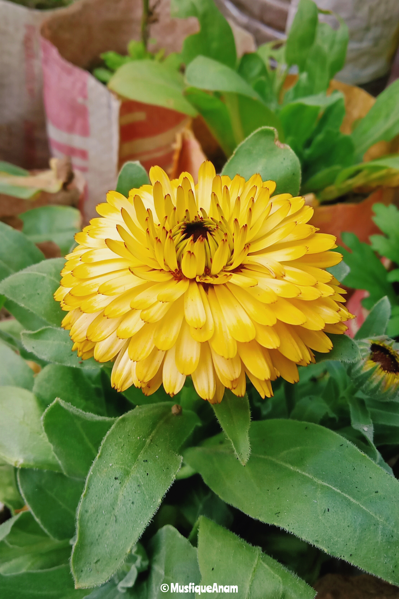
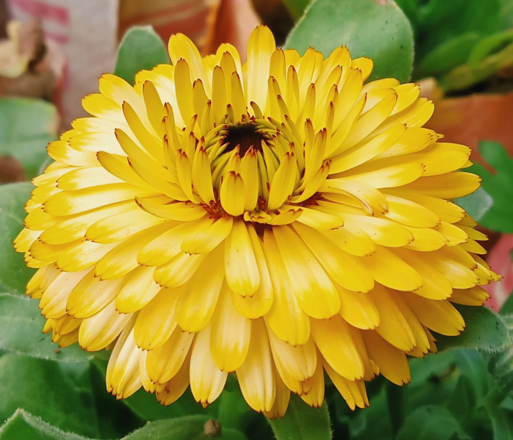
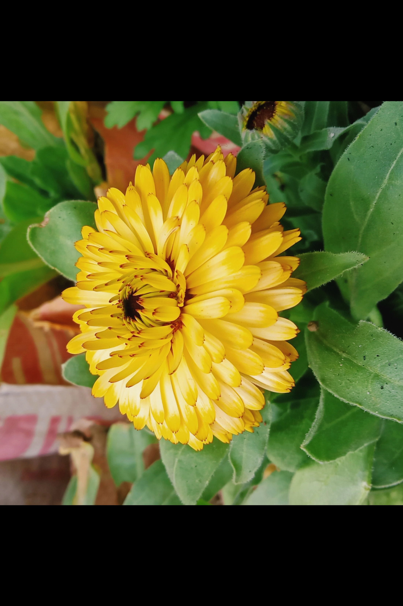
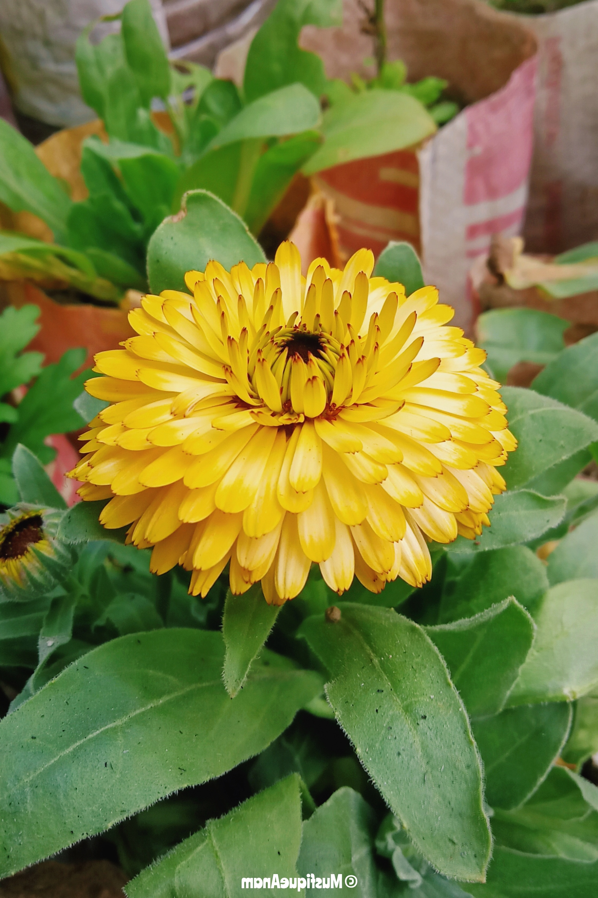
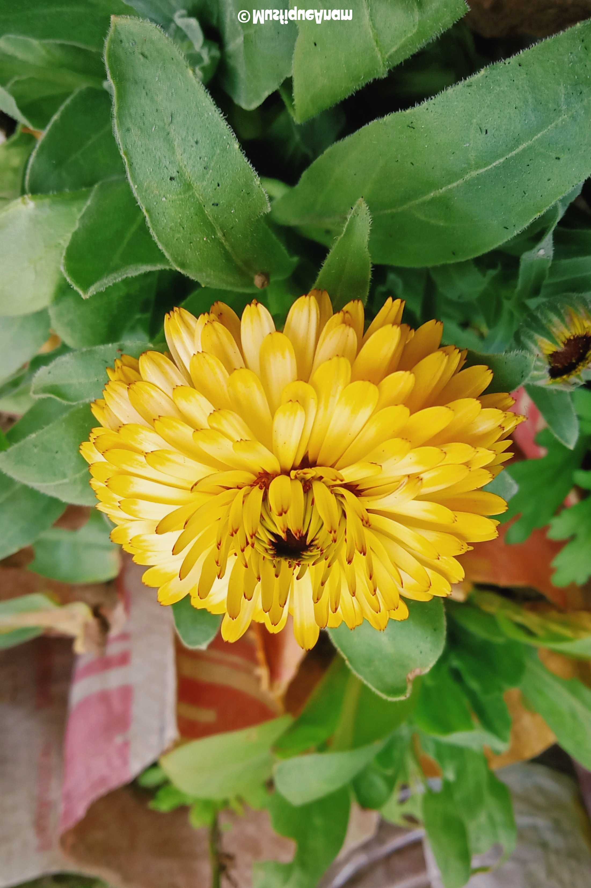

#  OpenCV Basics – My Learnings

This repository contains my **OpenCV image processing experiments**.  
It demonstrates reading, writing, displaying images, and performing basic transformations.

---

## 📖 Overview

**Objectives:**
- Install OpenCV and necessary Python libraries
- Read and write images
- Display images using Matplotlib
- Perform basic transformations:
  - Resize
  - Crop
  - Rotate
  - Flip (horizontal & vertical)

**Tools Used:**
- Python 3.13.5
- OpenCV (`opencv-python`)
- NumPy
- Matplotlib

---

## 📂 Repository Structure

opencv-basics/   
│   
├── images/  
│   └── sample.jpg  # input image  
│  
├── notebooks/  
│   └── opencv_basics.ipynb  
│  
│── results/  
│   ├── resized.jpg  
│   ├── cropped.jpg  
│   ├── rotated.jpg  
│   ├── flip_horizontal.jpg  
│   └── flip_vertical.jpg  
│  
├── README.md  
└── requirements.txt  

---

## 🚀 Setup Instructions

1. Clone the repository:

```bash
git clone https://github.com/yourusername/opencv-basics.git
cd opencv-basics

```
Install dependencies:

```bash
pip install -r requirements.txt
```

Open the notebook:

```bash
jupyter notebook notebooks/opencv_basics.ipynb
```
Run all cells to see code, notes, and outputs inline.


## Sample Outputs

| Original Copy | Resized | Cropped | Rotated | Flip Horizontal | Flip Vertical |
|---------------|---------|---------|---------|----------------|---------------|
|  |  |  |  |  |  |

📌 Notes
- Images in OpenCV are read in BGR format, so we convert to RGB for matplotlib.
- Resize changes dimensions without affecting colors.
- Crop slices the image matrix using [y1:y2, x1:x2].
- Rotate uses cv2.getRotationMatrix2D and cv2.warpAffine.
- Flip mirrors the image horizontally or vertically; outputs are saved separately.  
<br>

---

<br>
This repository documents my personal learnings with OpenCV basics.  
All notebooks and output images are provided for reference and further experimentation.